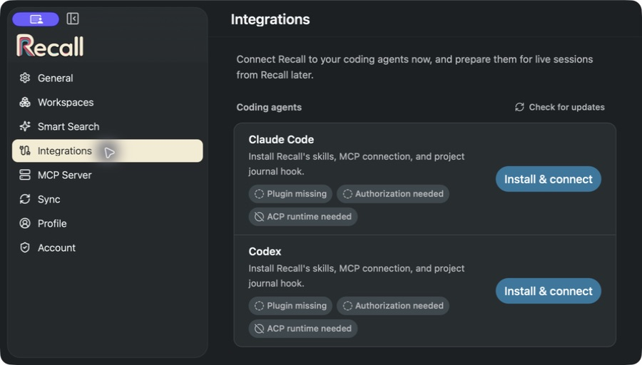
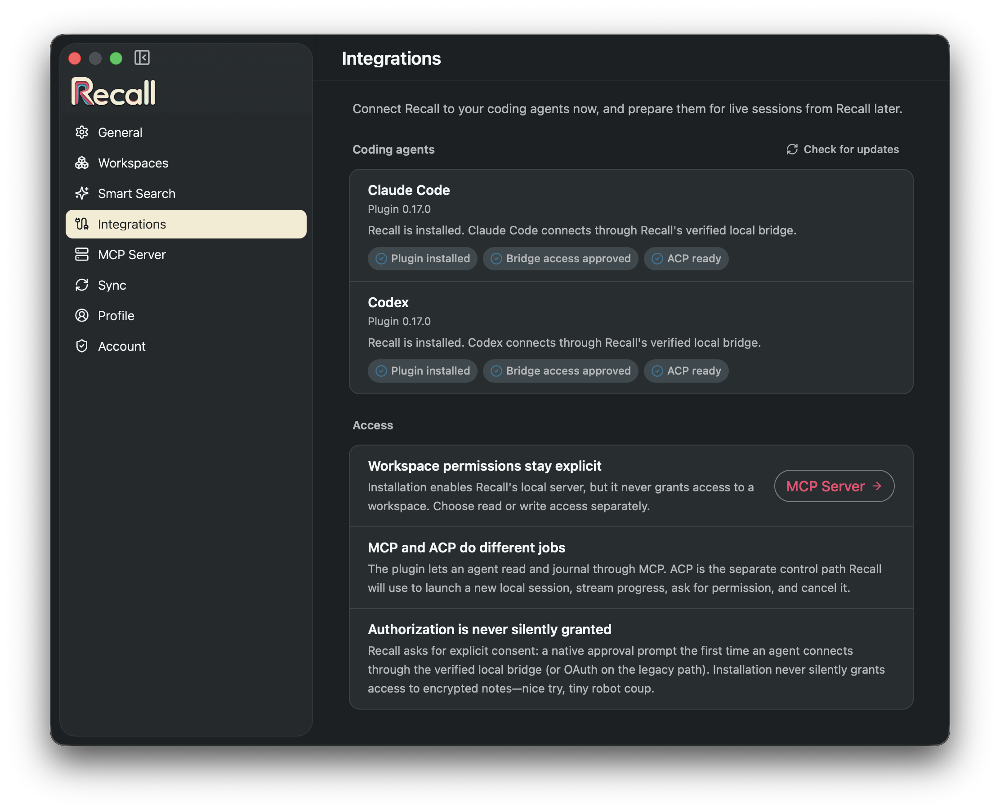

# Recall plugins

AI plugins for the Recall notes app. They connect Codex and Claude Code to the
notes tools in Recall for Mac and statically register the Claude Desktop Chat
and Cowork routes documented below.
Automatic memory support is narrower than skill installation or direct tool
use; see the [host and memory support matrix](plugins/recall/README.md#host-and-memory-support)
for the current Claude chat, Cowork, ChatGPT, Codex, Git, and non-Git boundary.

## Install from Recall for Mac

Use **Settings → Integrations** in Recall for Mac. This is the preferred setup
for both plugins.

1. Open the direct-download version of Recall and sign in.
2. Go to **Settings → Integrations**.
3. Click **Install & connect** for Claude Code, Codex, or both.
4. Go to **Settings → MCP Server** and choose **Block**, **Read**, or **Write**
   for each workspace.
5. Start a new agent thread. On the first connection, bring Recall to the
   front and approve the native access prompt.

Recall detects the agents installed on your Mac and shows what still needs to
be configured:

After setup, the page confirms the plugin, local bridge access, and ACP
runtime for each agent:

The direct-download app can add the marketplace and plugin, enable Recall's
local MCP server, and prepare the pinned ACP runtime. The sandboxed App Store
build cannot run the agent CLIs, so it opens the manual guide instead.

Installation never grants access to a workspace. Workspace permissions stay
separate under **Settings → MCP Server**. The current plugin connects through
Recall's signed local bridge and asks for native approval on first use. You can
revoke that approval at any time under **Local bridge access**. Older Recall
builds fall back to browser OAuth.

## Other setup guides

- [Install Claude Code or Codex manually](docs/manual-installation.md) if you
  use the App Store build, need a terminal workflow, or are maintaining an
  older installation.
- [Connect Hermes Agent](docs/hermes-agent.md) directly to Recall's local HTTP
  MCP server with OAuth, then install the Recall skill so Hermes knows how to
  use it. Hermes does not need the Claude Code or Codex plugin.

## Plugin behavior

`plugins/recall` connects Codex, Claude Code, and supported Claude Desktop
surfaces to the local MCP server hosted by the Recall Mac app. The plugin does
not run a notes server itself; it points the agent at the loopback endpoint
already managed by the signed-in Mac app.

The app installer enables the local MCP server. For a manual install, enable
it under **Settings → MCP Server**. Then start a new thread. The first time an
agent connects, Recall shows a native prompt asking you to approve MCP access
on this Mac. Approve it once and every agent using Recall's bridge is covered;
nothing is cached on disk.

No explicit login command and no browser step are needed. If the server does
not appear, run `codex mcp list` or `claude mcp list` to inspect the registered
name. Claude Code plugin servers are namespaced, so it normally appears as
`plugin:recall:recall`.

If the prompt does not appear, bring Recall to the front — the prompt waits
without stealing focus, and a connection that waits too long is refused with a
message telling the agent to open Recall. A denied or revoked grant is
remembered so a restarting agent cannot re-prompt in a loop; clear it with
**Allow again** under Settings → MCP Server → Local bridge access.

Each session names the transport it used in the host's MCP log
(`[recall] transport: local-socket` or `transport: oauth-http`) — the fastest
way to tell which path a connection took.

On the OAuth fallback path, plugins register useful client names: **Codex** for
the Codex plugin, **Claude** for every surface using the shared Claude plugin,
and **Claude Desktop** for the standalone desktop extension. The names are
self-reported, advisory session labels rather than authenticated host
principals. Their credentials are cached separately, so each registration can be
revoked independently. Rows named **MCP CLI Proxy** came from older plugin
versions and cannot be assigned back to a host reliably; after the named
registrations work, revoke those legacy rows in Recall.

Do not keep the shared Claude plugin and the legacy standalone Recall desktop
extension installed together. They register two local MCP entries for the same
Recall app, which can duplicate tools and connection prompts. Keep the shared
plugin as the single Claude installation path described here.

That fallback reads the installed app's protected-resource metadata before
authorizing. Older Recall builds continue to request only `notes:read` and
`notes:write`; builds that advertise structured Project context also add
`journal:read`. An existing notes-only grant is replaced
through normal browser consent when those capabilities become available.
Native local-bridge sessions need no OAuth scopes. `journal:write` remains out
of this release until structured write tools ship, and workspace Block/Read/Write
policy remains the independent data-access gate on both transports.

Older app builds without OAuth support can still use the shared bearer token —
see the legacy setup section in the
[plugin README](plugins/recall/README.md).

Start a new thread after installing and authorizing so the plugin tools are
loaded.

Write tools appear when at least one confirmed workspace is set to **Write**
in Recall's MCP Server settings. A workspace omitted from the policy remains
blocked.

The skills inspect the current MCP catalog before using newer note capabilities.
When available, they can read one named note's accepted activity and pair
canonical Markdown reads with opaque revision-checked content updates. Older
Recall builds keep the existing HTML/readback workflow; the skills never send
only half of the revision-safe field pair. Structured version 3 and version 4
project memory remain reader-only and exclusive, and never fall through to
these legacy named-note tools. Version 3 is repository-only. Version 4 remains
repository-first but can read one explicitly configured default Recall Project
only when the hook proves the session has no repository identity; it is never
an error fallback. Existing version 1/2 global users are not auto-migrated, so
their non-Git memory keeps working.

The plugin supports multiple skills in its `skills/` directory. In addition to
the direct note workflow, the journal skill
(`$recall:recall-journal` in Codex,
`/recall:recall-journal` in Claude Code) configures a per-agent
`recall-journal.json` with a global destination and/or absolute-path filesystem
project destinations. Each selects a Recall workspace and optional Recall
Project. A bundled per-prompt hook detects that valid opt-in config, reminds
the agent to search prior journal notes for
relevant context when a task relates to earlier work, and reminds it to
journal meaningful work live in that write-ready workspace. Each chat thread
keeps exactly one journal note — a dateless topic-phrase title, a short
always-visible intro, and one collapsible toggle entry per checkpoint whose
summary line stays human-readable while agent detail and hidden bookkeeping
live inside the collapsed details — so an interrupted session leaves a
partial record instead of nothing, and a busy thread never scatters notes.
On days the thread wraps up meaningful work, the journal adds at most one
tiny ELI5 Today card linking to the thread's note (or none when day summaries
are disabled).
A config that still selects the retired legacy DailyNote summary target gets
a one-time prompt to switch to Today or none; the Recall server no longer
creates DailyNotes, so the journal never writes them.
Asking the agent to reconfigure the current filesystem
project updates only its destination in the same config, so sessions working
anywhere inside that project's folder — including Codex- or Claude-managed
linked worktrees stored elsewhere on disk — journal to the project's own
workspace and optional Recall Project instead of the global destination.

After installing or updating the plugin, start a new thread so its skills,
tools, and hook are loaded. Codex requires a one-time review and trust decision
for the plugin hook. The first explicit `$recall:recall-journal` invocation
checks the active Codex hook inventory and asks the user to open `/hooks` when
the Recall handler is new, modified, disabled, or missing. The skill never
changes or bypasses hook trust; Claude Code skips this Codex-only preflight
because it has no separate per-hook trust switch. The hook reads the per-agent
journal config, asks local Git for worktree metadata when available, and adds
agent context; the journal skill still validates the live workspace and
performs every note write through the Recall MCP server.
